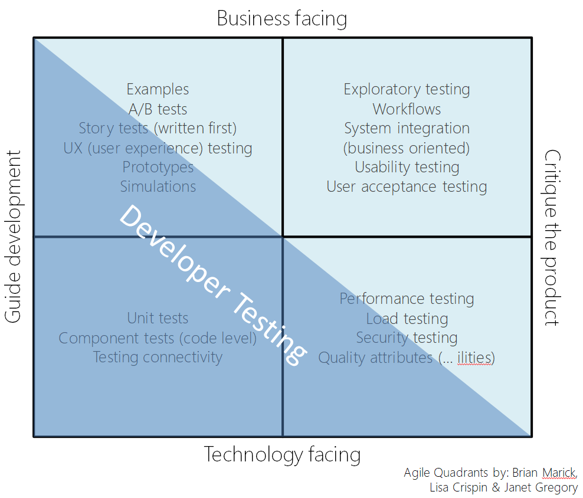

# 학습 키워드

- V 모델
- Test Matrix
- 내적 품질(테스트 코드 작성등)을 높이면 좋은 이유
- JUnit
- 단위 테스트
- E2E 테스트

## 학습 내용

### V 모델

&nbsp;

> 소프트웨어 개발 프로세스로 폭포수 모델의 확장된 형태 중 하나로 볼 수 있다. 아래 방향으로 선형적으로 내려가면서 진행되는 폭포수 모델과 달리, 이 프로세스는 코딩 단계에서 위쪽으로 꺾여서 알파벳 V자 모양으로 진행된다. V 모델은 개발 생명주기의 각 단계와 그에 상응하는 소프트웨어 시험 각 단계의 관계를 보여준다.

V 모델은 각 단계에 대한 테스트를 나누고, 처음부터 어떻게 테스트해야 하는지 결정하려고 노력한다.

1. 요구사항 분석 → 사용자 중심 ⇒ 인수 테스트
2. 시스템 설계 → 시스템 사양 결정 ⇒ 시스템 테스트
3. 아키텍처 설계 → 고수준 설계 ⇒ 통합 테스트
4. 모듈 설계 → 저수준 설계 ⇒ 단위 테스트
5. 구현 → 코딩

&nbsp;

### Test Matrix

&nbsp;

#### 1사분면 

- 테스트 주도 개발을 나타내며 애자일 개발 실천법의 핵심
- 개발자 중심 테스트 또는 기술 중심 테스트
- 코드 내부 품질 측정 가능

#### 2사분면

### 내적 품질(테스트 코드 작성등)을 높이면 좋은 이유

### JUnit

### 단위 테스트

### E2E 테스트
